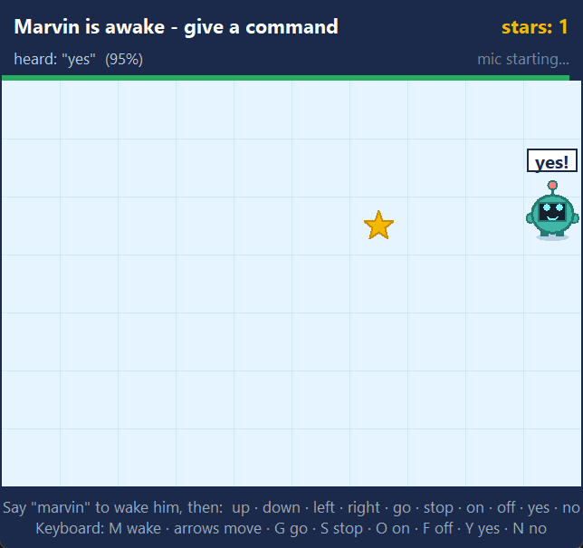
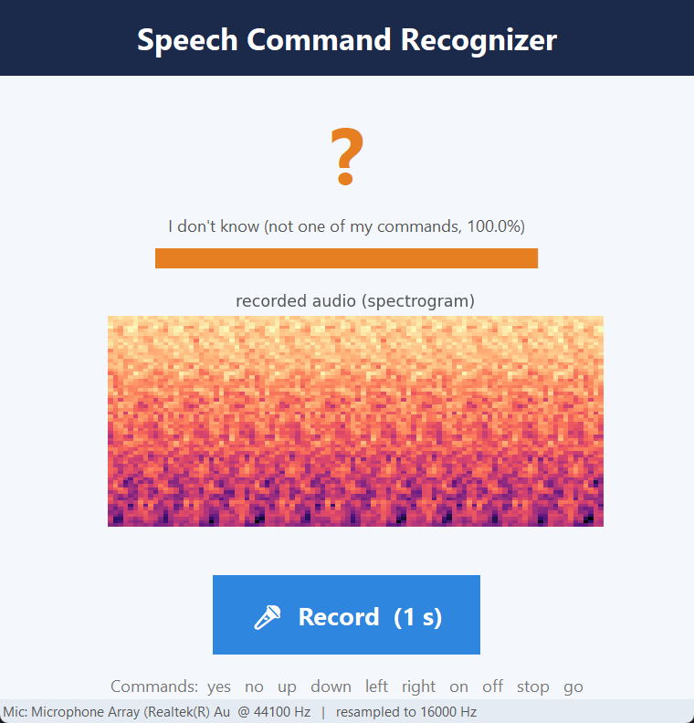
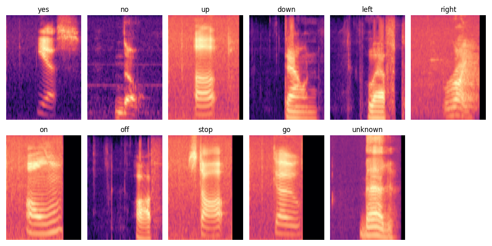

# Marvin — Voice Commands with a Wake Word

A speech-recognition project built on two convolutional neural networks (CNNs) that turn short spoken words into actions, running live on a laptop CPU.

- **Wake word.** A small model listens continuously for the word **"marvin"** and ignores everything else.
- **Commands.** Once awake, a second model recognises 10 commands (**yes, no, up, down, left, right, on, off, stop, go**) and answers **"I don't know"** when it hears anything else.
- **A game to show it off.** Marvin is a little robot on screen. Wake him by name, then walk him around, switch the lights on and off, and collect stars with your voice.

<p align="center">
  
</p>

The project started as lab **LabML21** of a machine-learning course: a 10-word classifier with push-to-talk. It was then extended with an "unknown" class, a wake word, always-on listening and the game.

---

## Contents

1. [Quick start](#1-quick-start)
2. [The three ways to use it](#2-the-three-ways-to-use-it)
3. [Project structure](#3-project-structure)
4. [How it works](#4-how-it-works)
5. [Results](#5-results)
6. [Retraining the models](#6-retraining-the-models)
7. [Settings you can tune](#7-settings-you-can-tune)
8. [Engineering lessons](#8-engineering-lessons)
9. [Troubleshooting](#9-troubleshooting)
10. [Limitations and ideas](#10-limitations-and-ideas)
11. [Credits](#11-credits)

---

## 1. Quick start

**Requirements:** Windows, Python 3.12, a microphone. No GPU needed.

```powershell
# from the project folder
python -m venv .venv
.venv\Scripts\Activate.ps1
pip install -r requirements.txt

python marvin_game.py
```

The trained models are already in `models/`, so **the apps run without the dataset**. You only need the dataset (section 6) to retrain.

---

## 2. The three ways to use it

| Command | What it is | Wake word? |
|---|---|---|
| `python marvin_game.py` | **The demo.** A robot you drive with your voice. | yes ("marvin") |
| `python listener.py` | Always-on console version. Prints each command it hears. | yes ("marvin") |
| `python push_to_talk.py` | Click **Record**, say one word, and see the prediction, its confidence and the spectrogram the model saw. | no |

Run only one at a time, because they all use the microphone.

### Marvin game

1. Marvin starts asleep (**Zzz**, eyes closed).
2. Say **"marvin"**. His antenna lights up, his eyes open, and a green bar at the top starts a 10-second countdown.
3. Give commands one at a time. Each command resets the 10 seconds, so you only say his name once per session.

| Say | Marvin… |
|---|---|
| up / down / left / right | turns and takes one step that way |
| go / stop | keeps walking forward / stops (he also stops at walls) |
| on / off | switches to day / night |
| yes / no | does a happy hop / shakes his head |
| anything else | shows a "?" bubble ("I don't know") |

Walk him over the **gold star** to score; a new one then appears somewhere else.
**Keyboard backup** in case a microphone misbehaves during a demo: `M` wake, arrow keys move, `G` go, `S` stop, `O` on, `F` off, `Y` yes, `N` no.

### Push-to-talk

<p align="center"></p>

The screenshot shows a recording of a silent room. The model correctly answers *"I don't know"* instead of forcing a guess.

---

## 3. Project structure

```
SpeechCommandCNN/
├── README.md
├── requirements.txt
│
├── config.py            all settings: paths, word lists, thresholds, epochs
├── audio_features.py    audio -> log-mel spectrogram, plus training augmentations
├── voice_engine.py      live microphone + model inference (shared by the 3 apps)
│
├── train_commands.py    trains/evaluates the 11-class command model
├── train_wake_word.py   trains/evaluates the "marvin" wake-word model
│
├── marvin_game.py       the voice-controlled robot game
├── listener.py          console wake-word listener
├── push_to_talk.py      click-to-record GUI
│
├── models/
│   ├── command_cnn.keras             current command model (10 words + unknown)
│   ├── wake_word_cnn.keras           wake-word model
│   └── command_cnn_v1_10words.keras  original lab model (10 words, no "unknown")
├── data/
│   └── speech_commands/     the dataset, one folder per word (only needed to train)
├── cache/
│   └── command_features.pkl pre-computed spectrograms (1.3 GB, safe to delete)
└── docs/
    ├── SpeechCommand_Report.md         original lab report (describes the v1 model)
    ├── SpeechCommand_Presentation.pdf  original presentation
    ├── make_presentation.py            script that generates that PDF
    └── figures/                        spectrograms, training curves, screenshots
```

**How the code depends on itself:**

```
config.py ─────────┬──────────────────────────────────────────────┐
audio_features.py ─┤                                              │
                   ├── train_commands.py, train_wake_word.py      │
                   └── voice_engine.py ── listener.py, push_to_talk.py, marvin_game.py
```

**Old names**, for anyone who knew the lab version:

| Before | Now |
|---|---|
| `LabML21_speechcmd_CNN.py` | `train_commands.py` (the live mic loop at the end is now `push_to_talk.py`) |
| `speech_gui.py` | `push_to_talk.py` |
| `streaming_listener.py` | `listener.py` + `voice_engine.py` |
| `wake_word_train.py` | `train_wake_word.py` |
| `speech_cmd_cnn.keras` | `models/command_cnn.keras` |
| `speech_cmd_data.pkl` | `cache/command_features.pkl` |

---

## 4. How it works

### 4.1 From sound to picture: the log-mel spectrogram

CNNs are built for images, so every one-second clip of audio is first turned into an image ([audio_features.py](audio_features.py)):

1. **Fixed length.** Audio is 16 kHz mono, padded or cut to exactly 1 s (16,000 samples).
2. **STFT.** The clip is chopped into overlapping 25 ms windows, moved forward 10 ms at a time. For each window we measure how much energy is at each frequency. This gives a grid with *time* on one axis, *frequency* on the other, and brightness for volume.
3. **Mel scale.** The 257 frequency bins are merged into 64 bins spaced like human hearing: fine at low pitch, coarse at high pitch (80–7,600 Hz).
4. **Log.** Loudness is compressed the way ears perceive it.
5. **Per-sample normalisation.** Each image is shifted and scaled by its own mean and standard deviation, so a quiet microphone and a loud one look the same.

The result is a **98 × 64 image** (98 time steps × 64 frequency bands):

<p align="center"></p>

Each word has its own shape. The black bands on the right are silence padding for clips shorter than one second.

### 4.2 The command model: 10 words + "unknown"

[train_commands.py](train_commands.py) trains a CNN with 11 outputs.

**Architecture**

| Layer | Output | Why |
|---|---|---|
| Conv 3×3, 32 filters + BatchNorm + MaxPool | 49×32×32 | small local patterns (edges of sounds) |
| Conv 3×3, 64 filters + BatchNorm + MaxPool | 24×16×64 | combinations of patterns |
| Conv 3×3, 128 filters + BatchNorm + MaxPool + Dropout 0.3 | 12×8×128 | word-level shapes; dropout stops it memorising voices |
| Global average pooling | 128 | far fewer parameters than Flatten, less overfitting |
| Dense 128 + BatchNorm + Dropout 0.3 | 128 | |
| Dense 11, softmax | 11 | one probability per class |

Adam optimiser, sparse categorical cross-entropy, batch size 64, up to 30 epochs. The learning rate is halved when the validation loss stops improving, and training stops early after 6 epochs without progress, keeping the best weights.

**Data.** The dataset has about 2,370 clips per command word. Each clip is used twice: once clean, and once **augmented** so the model learns robustness instead of memorising recordings:
- random time shift of up to ±100 ms
- light Gaussian noise (a different microphone)
- 30% chance of mixing in real background noise (running tap, fans, white noise)
- **SpecAugment**: a random band of frequencies and a random slice of time are blacked out on the spectrogram

**The "unknown" class.** A classifier with only 10 outputs *must* pick one of them, even for "cat", a cough or silence. So an 11th class is built from the **20 other words** in the dataset (bird, cat, house, the digits…) plus **300 pure background-noise crops**. It has about 4,700 examples, roughly the size of one command class, so the model isn't biased for or against it.

In total that's **52,064 spectrograms**, split 80/20 into training and test sets (stratified, with a fixed seed so the test set never changes).

**Two layers of "I don't know"** (in `voice_engine.describe`):
1. The model picks the `unknown` class: *"I don't know (not one of my commands)"*.
2. The model picks a command but with **less than 75% confidence**: *"I don't know (best guess: …)"*.

### 4.3 The wake-word model: "is that marvin?"

[train_wake_word.py](train_wake_word.py) trains a smaller CNN (2 conv blocks, 16 and 32 filters) with **one sigmoid output**: the probability that the last second contains "marvin". "Marvin" is one of the 30 words in the dataset (about 1,750 recordings), so no extra download is needed.

A model can't learn "only marvin" from marvin examples alone. It learns the boundary between what it is shown as *yes* and as *no*. Think of teaching a child "dog" using only pictures of dogs: they'd call a cat a dog too. So the training set deliberately includes several kinds of "not marvin":

| Examples | Count | Purpose |
|---|---|---|
| "marvin", clean + augmented | 3,492 | the target |
| "sheila" | 1,734 | **hard negative**: similar length and rhythm, teaches fine distinctions |
| 28 other words, evenly sampled | ~1,540 | general "some other word" |
| background-noise crops | 200 | "no word at all" |

### 4.4 Always-on listening ([voice_engine.py](voice_engine.py))

```
 microphone (its native rate, 44.1 kHz here)
      │  100 ms chunks, delivered by the audio driver's thread
      ▼
 queue ──► main loop keeps a rolling window of the last 1 second
                │  every 0.25 s:
                ▼
        loud enough?  ── no ──► wake probability = 0      (silence gate)
                │ yes
                ▼
        resample to 16 kHz → log-mel → wake model → probability
                │
        above 0.85 twice in a row? ── no ──► keep listening
                │ yes
                ▼
             AWAKE: capture the next 1 s → command model → answer
```

- **One microphone stream, opened once.** The driver's callback only drops chunks into a queue; all the heavy work happens on the main thread. This avoids driver overflows (section 8).
- **Silence gate.** If the loudest 100 ms of the window is quieter than `SPEECH_RMS_GATE`, the model isn't asked at all.
- **Debounce.** The probability must stay above 0.85 for **2 checks in a row** (~0.5 s). A real "marvin" lasts that long, while random clicks usually don't.
- **Fresh audio only.** After a command, the window must refill with a full second of new audio before it's judged again. That way it never judges leftover silence or the tail of the last word.

**In the game**, Marvin stays awake for 10 s after each command. While he's awake, every burst of sound louder than the onset threshold is captured as one command. The capture includes 0.3 s of audio from just *before* the sound started, so the beginning of the word isn't cut off.

---

## 5. Results

All numbers are on held-out test clips the models never trained on.

### Command model: **89.2%** test accuracy (10,413 test clips, 11 classes)

| Class | Recall | | Class | Recall |
|---|---|---|---|---|
| yes | 94.0% | | on | 89.1% |
| no | 89.9% | | off | 88.1% |
| up | 89.4% | | stop | 91.1% |
| down | 91.0% | | go | 89.3% |
| left | 90.5% | | **unknown** | **76.4%** |
| right | 92.7% | | | |

- **Real commands wrongly rejected as "unknown": only 1.4%** (136 of 9,473), so the new class rarely gets in the way.
- **Most confused pairs:** up→off (38), no→go (36), on→off (30), go→down (30), off→up (29). They sound alike, especially the vowels.
- **Other words** are caught as "unknown" 76% of the time. When they slip through, they're most often mistaken for "right" (41) or "on" (28).

**Compared with v1** (the original 10-word lab model, kept in `models/`): v1 scored **~93.6%**, but it had to pick one of 10 words for *everything*. In the same silent-room test, v1 answered *"up (99%)"* and the current model answers *"I don't know (100%)"*. The command words got a few points harder (~90.5% on average), in exchange for being able to say no.

### Wake-word model: **95.0%** test accuracy (1,394 test clips)

|  | predicted not-marvin | predicted marvin |
|---|---|---|
| **not marvin** | 655 | 40 (5.8% false alarms) |
| **marvin** | 30 (4.3% missed) | 669 |

These numbers use the plain 0.5 cutoff. Live, it uses 0.85, needs 2 hits in a row, and has the silence gate on top, so it's much stricter in practice.

### Training time (laptop CPU, no GPU)

| | first run | after that |
|---|---|---|
| Command model | ~10–15 min computing spectrograms + ~1.5 h training (early-stopped at epoch 26, best epoch 20) | spectrograms load from cache |
| Wake-word model | ~2 min spectrograms + ~5 min training | |

---

## 6. Retraining the models

**Dataset:** Google Speech Commands v0.01 (~1 GB, 30 words), Kaggle mirror:
<https://www.kaggle.com/datasets/neehakurelli/google-speech-commands>

Unzip it so the word folders sit directly in `data/speech_commands/`:
```
data/speech_commands/
├── _background_noise_/
├── yes/  no/  up/  down/  left/  right/  on/  off/  stop/  go/
├── marvin/  sheila/  bed/  bird/  cat/  dog/  ...  (the other 20 words)
```

**Both training scripts evaluate an existing model instead of retraining it.** To retrain, delete the model first:

```powershell
del models\command_cnn.keras
python train_commands.py        # ~1.5 h on CPU

del models\wake_word_cnn.keras
python train_wake_word.py       # ~5-8 min
```

Running a script while its model exists is useful by itself: it prints the test accuracy and confusion matrix without retraining.

**Caches.** Computing the spectrograms is slow, so the scripts save them to `cache/`. Delete a cache file to rebuild it, which you must do after changing the word lists or the spectrogram settings. `cache/` can be deleted entirely to free space.

**Changing the wake word.** Set `WAKE_WORD` in `config.py` to any word in the dataset (e.g. `sheila`, `house`, `happy`, `wow`), set `WAKE_HARD_NEGATIVE` to another dataset word, delete `models/wake_word_cnn.keras` and `cache/wake_word_features.pkl`, and retrain. A word that isn't in the dataset would need a few hundred recordings of it.

**Figures** (training curves, spectrograms) are saved to `docs/figures/`.

---

## 7. Settings you can tune

All in [config.py](config.py):

| Setting | Default | Raise it if… | Lower it if… |
|---|---|---|---|
| `WAKE_THRESHOLD` | 0.85 | it wakes up by itself | it doesn't react to "marvin" |
| `CONSECUTIVE_HOPS_REQUIRED` | 2 | random sounds wake it | it needs "marvin" said very slowly |
| `SPEECH_RMS_GATE` | 0.001 | silence/room noise wakes it | your voice doesn't register (check the `level` readout) |
| `COMMAND_CONF_THRESHOLD` | 75 % | it acts on wrong words | it says "I don't know" too often |
| `HOP_SECONDS` | 0.25 | the CPU can't keep up (mic overflows) | you want faster reactions |

In the game ([marvin_game.py](marvin_game.py)): `AWAKE_SECONDS` (10) is how long Marvin stays awake, and `ONSET_RMS` (0.001) is how loud a sound must be to count as a command.

`listener.py` and the game show the live **mic level** and **wake probability**, so you can tune by watching real numbers.

---

## 8. Engineering lessons

Problems hit while making this run live, and how they were solved. The model was rarely the hard part.

| Symptom | Cause | Fix |
|---|---|---|
| Froze on the **second** wake-up, every time | On this laptop's Realtek microphone, **playing any sound** (`winsound.Beep` or sounddevice output) killed the open input stream within 1–2 plays. Found by counting mic chunks with and without beeps: 17 → 8 → 0 vs a steady 16–17. | No beeps; the cue is visual only. |
| Freezes and "input overflow" after each command | The mic stream was stopped and reopened between wake-up and command | One stream for the whole session, feeding a queue |
| Got slower until it seemed frozen | `model.predict()` has heavy per-call overhead and degrades when called several times a second | Call `model(x, training=False)` directly |
| **Woke up in a silent room** (probability ~0.8) | Per-sample normalisation stretches near-silence into full-scale hiss the model never saw in training | Silence gate: don't run the model below a loudness threshold |
| Probability jumped right after each command | The buffer was refilled with zeros, so the model judged half-silence | Only judge a window of 100% fresh audio |
| One-off spikes triggered a wake | A single 0.25 s check was enough | Require 2 hits in a row |
| Answered "up (99%)" to silence | A 10-class model has no way to say "none of these" | The `unknown` class |

---

## 9. Troubleshooting

**Marvin never wakes up.** Watch the `level` readout while you say "marvin". Speech should clearly exceed `SPEECH_RMS_GATE` (0.001). If it barely moves, move closer or raise the microphone volume in *Windows Settings → System → Sound → Input*. Say "MAR-vin" at normal speed, with a short pause before it.

**It wakes up on its own** (music, singing, TV). This is a known limitation (section 10). Raise `WAKE_THRESHOLD` to ~0.95 or `CONSECUTIVE_HOPS_REQUIRED` to 3.

**Lots of "I don't know" for real commands.** The command window is exactly 1 second and starts the moment the *AWAKE* prompt appears (or, in the game, when you start speaking). Say the word promptly and clearly.

**"mic overflows" keeps rising.** The CPU is too busy: close heavy programs, or raise `HOP_SECONDS` to 0.5.

**No sound when it wakes up.** That's intentional (section 8).

**Yellow underlines on imports in VS Code / `ModuleNotFoundError: tensorflow`.** VS Code is using a different Python than the project's virtual environment. `Ctrl+Shift+P` → *Python: Select Interpreter* → pick the `.venv` one.

---

## 10. Limitations and ideas

- **Continuous speech, singing and music can trigger the wake word.** Its "not marvin" examples are all isolated words with silence around them, so it has never learned what running speech sounds like. The fix is more negatives of that kind: recordings of people talking, singing and music (ideally in the room where it's used), or synthetic "running speech" made by joining fragments of different words.
- **"unknown" catches 76% of other words.** More and more varied unknown examples would help.
- **Similar-sounding pairs** (up/off, no/go, on/off) cause most command errors.
- **One word per second.** Commands must fit in a 1-second window, and there's one command per capture.
- **English only, CPU only**, tested on one Windows laptop with one microphone.
- Ideas: fine-tune on a few minutes of the user's own voice; export to TensorFlow Lite to run on a Raspberry Pi; chain commands into sentences ("go … stop").

---

## 11. Credits

- **Dataset:** Speech Commands v0.01, Pete Warden (Google), CC BY 4.0. Warden, P. (2018). *Speech Commands: A Dataset for Limited-Vocabulary Speech Recognition.* arXiv:1804.03209.
- **Course:** Machine Learning labs (LabML21), starting from the instructor's lab code. The original lab report and presentation are in `docs/`.
- **Libraries:** TensorFlow/Keras, NumPy, SciPy, scikit-learn, pandas, Matplotlib, sounddevice, Tkinter.
